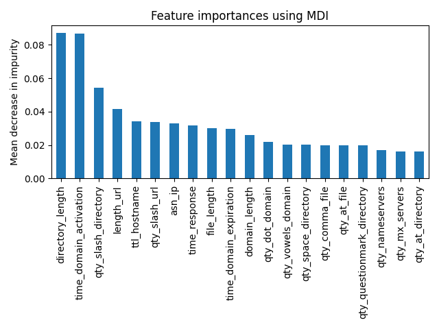
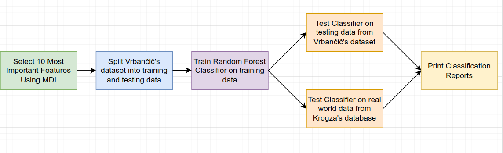
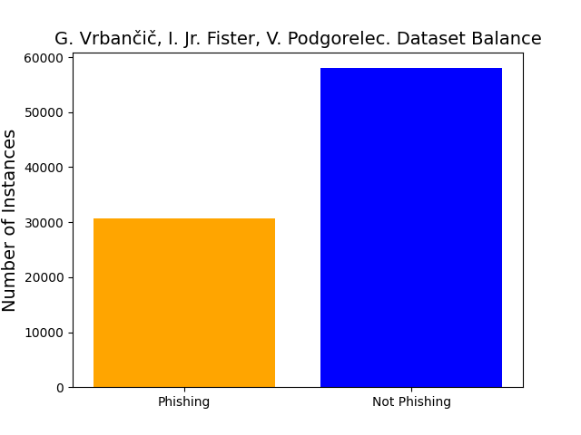
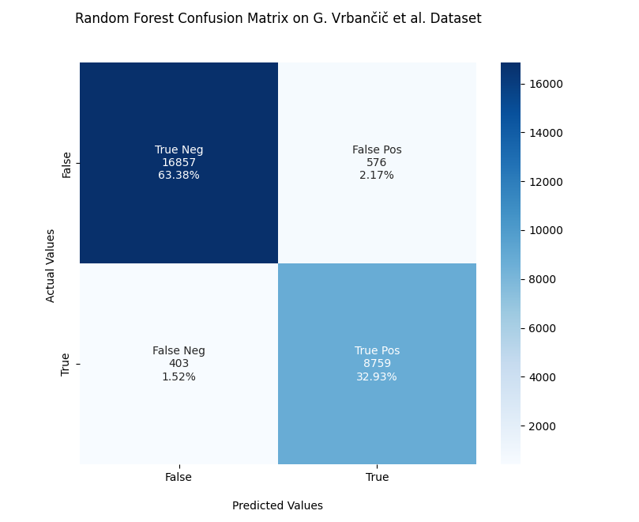

### William Foster - CPTS 315 - Spring 2022

[Link To PDF Version of Report](WilliamFoster-CPTS315-PhishingReport.pdf)

---
## Stopping E-Victimization: Detecting Phishing Links Using a Machine Learning Approach

Year after year, phishing attacks remain one of the most prevalent forms of cyber-crime that devastate businesses and individuals alike. In 2021, phishing attacks were responsible for more than 80% of reported security incidents (Graphus, 2022). Phishing is defined as a type of social engineering attack that is aimed at stealing user data, including usernames and passwords, and credit card information (Imperva, 2020). Phishing links, or URLs, propagate via e-mail, social media, and even SMS based text messaging. These attacks are so prevalent, that over 75% of businesses around the world have experienced some type of phishing attack (Graphus, 2022) and costs to businesses are estimated to be an average of $4.65 million annually (Spanning, 2022). 

My personal motivation for choosing this topic stems from my previous experience as a System Administrator. I have seen huge businesses nearly succumb to phishing attacks. One example that comes to mind is when a CFO clicked a phishing link to his “bank”, and typed in his credentials. A few hours later, his bank alerted him that someone was attempting to wire $30,000 USD to a country in Asia. Luckily, with the help of his bank, this attack was prevented, and we reported the attack to the FBI’s Internet Crime Complaint Center. In this specific instance, the attack was prevented, but many are not. This is why I believe a technical solution could potentially aid everyone who is a target of phishing e-crime. 

Some challenges I faced in this task were finding the appropriate machine learning algorithm to create my model, and preprocessing new data from the wild into feature vectors. Using a random forest classifier, I was able to obtain 96% accuracy on the testing data, and 78% accuracy on data from the wild.

## Data Mining Task

My data mining task was to create a phishing classifier with a recent phishing dataset (Vrbančič et al., 2020). My objective was to create a classifier from this dataset with a high accuracy rate that could make successful predictions on unseen data. To test my classifier on real world data, I used the Phishing Domain Database which is updated daily with new phishing links discovered from the wild (Krog & Chababy, 2022).

An example of inputs and outputs, as well as the 111-features visualized in 2D using t-SNE, are below:

### Table of Inputs and Outputs
| Link | Classification |
| ---- | -------------- |
| https://www.facebook.com/help/1297502253597210/?helpref=hc_fnav | Not Phishing|
| http://nettflixnwbns.com/Netflix/Login | Phishing | 

### t-SNE Visualization

My question that I sought to answer was “Is it possible to create a classifier with a high accuracy rate
that worked well on real data?”. The key challenges to this task was finding the most important features
from my input dataset that did not rely on an expensive API, and figuring out a way to extract the same
features from new links from the Phishing Domain Database in an expedited fashion.

## Technical Approach

My technical approach to solving this task was first to find the 10 most important features from Vrbančič et al.’s 2020 dataset. To do this, I used Mean Decrease in Inpurity (MDI) feature selection. The 10 features I found had 3 features that I could not extract myself because I did not have API keys for PhishTank or Web of Trust. To remedy this, I found the top 20 features, and used the next 3 most important features to replace the features I could not extract. The 20 most important features found using MDI are shown below:

### Feature Importances using MDI

The 10 features I chose are the following:

|                  |                        |                     |
| ---------------- | ---------------------- | ------------------- |
| directory_length | time_domain_activation | qty_slash_directory |
| length_url | domain_length | asn_ip |
| qty_slash_url | qty_dot_domain | qty_vowels_domain |
| file_length |

After getting the 10 most important features, I stripped Vrbančič et al.’s dataset of all the other features using the Pandas library. I then split the data into training and testing datasets using Scikit-Learn with a 70% / 30% split respectively. One of the major challenges I faced was deciding which machine learning classifier to use. To overcome this, I read several papers surveying the current state of AI - powered phishing classifiers. The research showed that the “(Random Forest) method gives the best performance with the highest accuracy among any other classification methods on different datasets.” (Basit et al., 2020). 

Separately, I also tested the model on the Phishing Domain Database (Krog & Chababy, 2022), which posed it’s own challenges listed in my evaluation methodology.

A diagram of this approach is shown below:

### Block Diagram of Technical Approach

## Evaluation Methodology

The first dataset used was from Vrbančič (Vrbančič et al., 2020). This dataset has 111 features, and 88,647 labeled instances. The full dataset is unbalanced, with mostly benign links and fewer phishing links.

The second source I used was the Phishing Domain Database (Krog & Chababy, 2022). This source is a daily updated database that contains identified phishing links from the wild. To use this database to cross-examine my model, I needed to extract the same 10 features from this links as were extracted in the original dataset from Vrbančič et al. The problem was that Vrbančič et al.’s dataset was already packaged as feature vectors and did not contain a program to extract features from URLs. To overcome this challenge, I first randomly sampled the database to gather 1000 phishing links, and then used the url-feature-extractor project created by Ayres et al. to gather the same 10 features that I was interested in. A challenge using the url-feature-extractor was that the features were in Portuguese, so I needed to translate them into the same features I needed. After running this extractor on the 1000 phishing links over the course of several hours, I obtained a dataset that was almost ready to use. I only needed to strip out the features that I didn’t need, and preprocess all of the data that was missing (replacing “?” with “- 1” to match the training dataset). This dataset was now ready to be used for predictions.

To evaluate the classifier, the main metrics I was concerned with was False Negatives, followed by False Positives. This is because False Negatives are more dangerous than False Positives from a security standpoint, but false positives are still of concern because “in real-time phishing detection systems, this (false positives) directly affects the user experience and trustworthiness” (Tang & Mahmoud, 2021).

## Results and Discussion

My results showed that the random forest classifier did exceptionally well when making predictions on the first dataset, as shown in the confusion matrix below. The false negative rate was very low at 1.52%, and false positive followed behind at 2.17%.

This shows that the random forest classifier performs exceptionally well for training a phishing classifier, which previous work by Basit et al. also shows. 

However, in the real-world dataset (Random Forest Confusion Matrix on M. Krog’s dataset), the performance started to suffer and there was a 23.50% false negative rate, which is far too high to be used in any real world scenario. I theorize that the phishing classifier struggles with the recent data because phishing attacks have changed and so have the URL structures. The dataset that the model is trained on is originally from 2020, and these new examples are from the day this paper was written. I think another contributing factor is the small dataset that the model was originally trained on.

## Lessons Learned

In this project, I learned that the dataset you choose should be extremely recent, and that more data will build a strong classifier. I also learned some valuable skills, including how to use Scikit-Learn and various methods of visualizing datasets and visualizing classifier results. I think that a model that can deal with the data drift that occurs with attacks like phishing would be extremely beneficial, and could help remedy some of the high false positive rates found with the newer data. Another thing I would change if I were building this model for production would be to find a way to incorporate much larger datasets. I think this could be done by mapping common features between existing datasets, and building your own dataset like was done with the url-feature-extractor and M. Krog’s phishing link database. Future research could be developing a much faster URL feature extractor, as this would be hugely beneficial for faster response times in real-world applications. Furthermore, relying on third- party APIs has proven to be unreliable, as the popular site PhishTank isn’t handing out API keys anymore. Finding a way to circumvent these limitations could lead to an extremely robust classifier that has few dependencies.

## References

Ayres, L. D., Valcy S. Brito, I., & Souza, R. R. (2019). Utilizando Aprendizado de Máquina Para Detecção Automática de urls Maliciosas Brasileiras. Anais Do XXXVII Simpósio Brasileiro De Redes De Computadores e Sistemas Distribuídos (SBRC 2019). https://doi.org/10.5753/sbrc.2019.7416

Basit, A., Zafar, M., Liu, X., Javed, A. R., Jalil, Z., & Kifayat, K. (2020). A comprehensive survey of AI-enabled phishing attacks detection techniques. Telecommunication Systems, 76(1), 139–154. https://doi.org/10.1007/s11235-020-00733-2

Graphus. (2022, January 6). 10 facts about phishing that you need to see. Graphus. Retrieved April 29, 2022, from https://www.graphus.ai/blog/10-facts-about-phishing-in-2021-that-you-need-to-see/

Imperva. (2020, June 17). What is phishing: Attack Techniques & Scam examples: Imperva. Learning
Center. Retrieved April 29, 2022, from https://www.imperva.com/learn/application-security/phishing-attack-scam/#:~:text=What%20is%20a%20phishing%20attackinstant%20message%2C%20or%20text%20message.

Krog, M., & Chababy, N. (2022). Phishing Domain Database. GitHub. Retrieved April 29, 2022, from https://github.com/mitchellkrogza/Phishing.Database 

Spanning. (2022, January 18). Cyberattacks 2021: Statistics from the last year. Spanning. Retrieved April 29, 2022, from https://spanning.com/blog/cyberattacks-2021-phishing-ransomware-data- breach-statistics/

Tang, L., & Mahmoud, Q. H. (2021). A survey of machine learning-based solutions for phishing website detection. Machine Learning and Knowledge Extraction, 3(3), 672–694. https://doi.org/10.3390/make3030034

Vrbančič, G., Fister, I., & Podgorelec, V. (2020). Datasets for phishing websites detection. Data in Brief, 33, 106438. https://doi.org/10.1016/j.dib.2020.106438